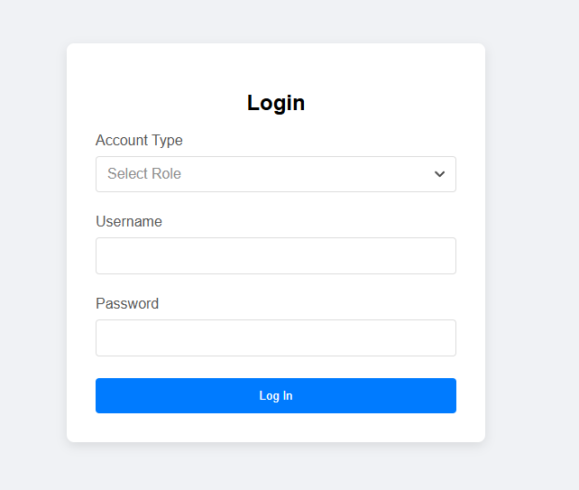
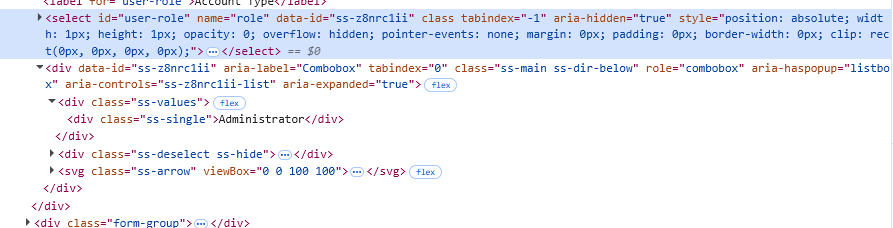

[< Return to README](../README.md)

## Writing a Component

The previous example only contained simple components. But the example below adds a dropdown.



The dropdown on this page is SlimSelect, which is stylized and provides more enhanced user experiences than standard select dropdown.



Looking at the source doe, while the select element does exist on the page, it is not visible, so any attempt to directly interact with it would throw error.
The actual visual elements are div tag under the select.

Because it is not a standard select dropdown, it needs to be defined.

### Creating the Component Class

To get started, we can start creating a Slim Select component class. It must be extended from ScComponent.

This forces us to implement **rules()** method where we can define what element properties are required.

At this point, it should be fairly clear what web element on the page should be referred as Slim Select component. There should be CSS classes or attributes that define them because those properties are needed to make this dropdown work. We can add them to the rules.

**rules()** method makes **ScComponentRule** object available, which gives fluent grammar to add a set of rules. If something is not right during the runtime, it attempts to give meaningful error messages that points you to what went wrong.


```java

// (imports and package are omitted)

public class ScSlimSelectDropdown extends ScComponent {
    @Override
    protected void rules(ScComponentRule rule) {
        rule.tag().is("div");
        rule.attr("aria-label").is("Combobox");
        rule.attr("role").is("combobox");
        rule.attr("aria-controls").isPresent();        
    }
}
```
### Defining Public Facing Methods

This is a single select dropdown, so primarily, these 2 functionalities will be needed:

- Select from a list of options.
- Get selected item text.

We can start by adding them as public facing methods. Everything else is going to be private within this class to make these 2 methods work.

```java
// (imports and package are omitted)

public class ScSlimSelectDropdown extends ScComponent {
    @Override
    protected void rules(ScComponentRule rule) {
        rule.tag().is("div");
        rule.attr("aria-label").is("Combobox");
        rule.attr("role").is("combobox");
        rule.attr("aria-controls").isPresent();
    }
    
    public String selectedText() {
    }

    public void select(String text) {
    }
    
}

```
### Defining Selectors

To make these public facing methods work, we need to interact with several internal objects:

- Arrow button that opens the dropdown when clicked.
- The dropdown panel itself.
- The list of options.
- The element that contains the selected text.

All these sits as descendent element to this element except for the dropdown panel and options. These sit at the bottom of the HTML page and appear when triggered (clicking the arrow button).

To indicate that the scope is the entire page rather than with this element, *_cssSelector.page()* method is used.

By using of **_cssSelector**, the CSS selectors are being generated. The limitation of the CSS selectors applies, and the framework makes them clear what properties are available to it.

If more complex selections are needed, **_xpath** is also available which gives more functionalities (at the cost of potential hit in execution efficiency compared to CSS selector).

```java
// (imports and package are omitted)

public class ScSlimSelectDropdown extends ScComponent {
    // Selectors are at the top.
    private static final ScCssSelector ARROW_BUTTON = _cssSelector.descendant(_tag("svg"), _cssClasses("ss-arrow"));
    private static final ScCssSelector SELECTED_TEXT = _cssSelector.descendant(_tag("div"), _cssClasses("ss-single"));

    // "page" changes the scope to see the entire page rather than descendent.
    private static final ScCssSelector CONTENT_PANEL = _cssSelector.page(_tag("div"), _cssClasses("ss-content", "ss-open"));

    // You can concatenate selectors.
    private static final ScCssSelector LIST_ITEMS = CONTENT_PANEL.descendant(_tag("div"), _cssClasses("ss-option"));

    // Set rules.
    @Override
    protected void rules(ScComponentRule rule) {
        rule.tag().is("div");
        rule.attr("aria-label").is("Combobox");
        rule.attr("role").is("combobox");
        rule.attr("aria-controls").isPresent();
    }

    public String selectedText() {
    }

    public void select(String text) {
    }
}
```

### Defining Components

Using the selectors, we can now define components. In this particular case, none of the component needs to be exposed to public, so they can remain private.

Both the arrow dropdown and option items must be capable of being clicked. To give them that method, we define internal class for each that overrides abstract **ScClickableComponent** class.

the selected text only needs text property, so it can be defined as **ScGenericComponent** which only exposes text property. *\$genericComponent()* method is a shorthand for *\$component(selector, ScGenericComponent.class)*.

```java
// (imports and package are omitted)

public class ScSlimSelectDropdown extends ScComponent {
    // Selectors are at the top.
    private static final ScCssSelector ARROW_BUTTON = _cssSelector.descendant(_tag("svg"), _cssClasses("ss-arrow"));
    private static final ScCssSelector SELECTED_TEXT = _cssSelector.descendant(_tag("div"), _cssClasses("ss-single"));

    // "page" changes the scope to see the entire page rather than descendent.
    private static final ScCssSelector CONTENT_PANEL = _cssSelector.page(_tag("div"), _cssClasses("ss-content", "ss-open"));

    // You can concatenate selectors.
    private static final ScCssSelector LIST_ITEMS = CONTENT_PANEL.descendant(_tag("div"), _cssClasses("ss-option"));

    // Set rules.
    @Override
    protected void rules(ScComponentRule rule) {
        rule.tag().is("div");
        rule.attr("aria-label").is("Combobox");
        rule.attr("role").is("combobox");
        rule.attr("aria-controls").isPresent();
    }

    public String selectedText() {
    }

    public void select(String text) {
    }

    // Components on this component. None of these need to be public.
    private ScArrowButton arrowButton() {
        return $component(ARROW_BUTTON, ScArrowButton.class, this);
    }

    private ScGenericComponent contentPanel() {
        return $genericComponent(CONTENT_PANEL);
    }

    private ScComponentCollection<ScListItem> listItems() {
        return $$components(LIST_ITEMS, ScListItem.class, this);
    }    
    /*
        Inner classes.
     */

    public class ScArrowButton extends ScClickableComponent {
        @Override
        protected void rules(ScComponentRule rule) {
            rule.tag().is("svg");
            rule.cssClasses().has("ss-arrow");
        }
    }

    public class ScListItem extends ScClickableComponent {
        @Override
        protected void rules(ScComponentRule rule) {
            rule.tag().is("div");
            rule.cssClasses().has("ss-option");
        }

        public boolean isSelected() {
            return this.cssClasses().contains("ss-selected");
        }
    }
}
```

### Implementing Public Methods

With all internal components in place, we can now implement public methods.

We also override *text()* method, because without that, the returned text would be unfiltered inner text and not useful. We'll just return the selected text.

```java
// (imports and package are omitted)

public class ScSlimSelectDropdown extends ScComponent {
    // Selectors are at the top.
    private static final ScCssSelector ARROW_BUTTON = _cssSelector.descendant(_tag("svg"), _cssClasses("ss-arrow"));
    private static final ScCssSelector SELECTED_TEXT = _cssSelector.descendant(_tag("div"), _cssClasses("ss-single"));

    // "page" changes the scope to see the entire page rather than descendent.
    private static final ScCssSelector CONTENT_PANEL = _cssSelector.page(_tag("div"), _cssClasses("ss-content", "ss-open"));

    // You can concatenate selectors.
    private static final ScCssSelector LIST_ITEMS = CONTENT_PANEL.descendant(_tag("div"), _cssClasses("ss-option"));

    // Set rules.
    @Override
    protected void rules(ScComponentRule rule) {
        rule.tag().is("div");
        rule.attr("aria-label").is("Combobox");
        rule.attr("role").is("combobox");
        rule.attr("aria-controls").isPresent();
    }

    @Override
    public String text() {
        return selectedText();
    }

    private ScArrowButton arrowButton() {
        return $component(ARROW_BUTTON, ScArrowButton.class, this);
    }

    private ScGenericComponent contentPanel() {
        return $genericComponent(CONTENT_PANEL);
    }

    private ScComponentCollection<ScListItem> listItems() {
        return $$components(LIST_ITEMS, ScListItem.class, this);
    }

    public String selectedText() {
        final ScGenericComponent selectedText = $genericComponent(SELECTED_TEXT);

        return selectedText.isDisplayed() ? selectedText.text() : "";
    }

    public void select(String text) {
        arrowButton().click();
        waitForComponent(contentPanel(), ScWaitCondition.ToBeDisplayed);
        listItems().entry(text).click();
        waitForComponent(contentPanel(), ScWaitCondition.ToBeHidden);
    }

    /*
        Inner classes.
     */

    public class ScArrowButton extends ScClickableComponent {
        @Override
        protected void rules(ScComponentRule rule) {
            rule.tag().is("svg");
            rule.cssClasses().has("ss-arrow");
        }
    }

    public class ScListItem extends ScClickableComponent {
        @Override
        protected void rules(ScComponentRule rule) {
            rule.tag().is("div");
            rule.cssClasses().has("ss-option");
        }
    }
}
```
But it is a little cumbersome to have to define a new class, just so we can do a click. To address that, there is **clickGenericComponent()** method. Use of that can completely eliminate the need to define new inner class in this case, making the code a ittle cleaner.

```java
// (imports and package are omitted)

public class ScSlimSelectDropdown extends ScComponent {
    private static final ScCssSelector ARROW_BUTTON = _cssSelector.descendant("svg", _cssClasses("ss-arrow"));
    private static final ScCssSelector SELECTED_TEXT = _cssSelector.descendant("div", _cssClasses("ss-single"));
    private static final ScCssSelector CONTENT_PANEL = _cssSelector.page("div", _cssClasses("ss-content", "ss-open"));
    private static final ScCssSelector LIST_ITEMS = CONTENT_PANEL.descendant("div", _cssClasses("ss-option"));

    @Override
    protected void rules(ScComponentRule rule) {
        rule.tag().is("div");
        rule.attr("aria-label").is("Combobox");
        rule.attr("role").is("combobox");
        rule.attr("aria-controls").isPresent();
    }

    private ScGenericComponent arrowButton() {
        return $component(ARROW_BUTTON, ScGenericComponent.class);
    }

    private ScGenericComponent contentPanel() {
        return $genericComponent(CONTENT_PANEL);
    }

    private ScComponentCollection<ScGenericComponent> listItems() {
        return $$components(LIST_ITEMS, ScGenericComponent.class);
    }

    @Override
    public String text() {
        return selectedText();
    }

    public String selectedText() {
        final ScGenericComponent selectedText = $genericComponent(SELECTED_TEXT);

        return selectedText.isDisplayed() ? selectedText.text() : "";
    }

    public void select(String text) {
        // Click the arrow button.
        clickGenericComponent(arrowButton());
        waitForComponent(contentPanel(), ScWaitCondition.ToBeDisplayed);
        // Click the list item.
        clickGenericComponent(listItems().entry(text));
        waitForComponent(contentPanel(), ScWaitCondition.ToBeHidden);
    }
}
```

Once **ScSlimSelectDropdown** class is defined, it can be used in any places where the Slim Select appears on a page in applications. Typically,
the same web components are repeatedly used within an application for consistent look and saving development time. While it may take some time to initially build the component, it
can easily pay off in saved time, as more page classes are created.

Note that this is based on Slim Select being a single select dropdown. If this component allows different mode (like multi-select options), it can be implemented within this class, or create a new class for handling it.

### Using the Component in Test

Below is an example test that utilizes the Slim Select (TestNG).

```java 
// (imports and package are omitted)

public class ScLoginEnhancedTest {
    private final ScWithPage<ScLoginEnhancedPage> loginPage = ScPage.with(ScLoginEnhancedPage.class);

    @BeforeClass
    public void setup() {
        Selentic.open("file://" + System.getProperty("user.dir") + "/build/resources/test/test_file/login-enhanced.htm");
    }

    @AfterClass(alwaysRun = true)
    public void finish() {
        Selentic.quit();
    }

    @Test
    public void testLogin() {
        loginPage.inPage(p -> {
            Assert.assertEquals(p.accountTypeDropdown().selectedText(), "");

            p.accountTypeDropdown().select("Viewer");

            Assert.assertEquals(p.accountTypeDropdown().selectedText(), "Viewer");

            p.accountTypeDropdown().select("Editor");

            Assert.assertEquals(p.accountTypeDropdown().selectedText(), "Editor");

            p.userNameTextbox().enterText("test");

            Assert.assertEquals(p.userNameTextbox().text(), "test");

            p.passwordTextbox().enterText("test123");

            Assert.assertEquals(p.passwordTextbox().text(), "test123");

            p.loginButton().click();
        });
    }
}
```
