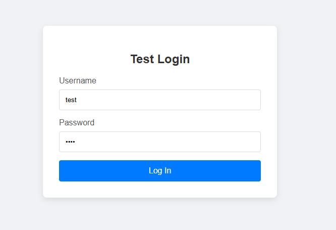

[< Return to README](../README.md)
## Writing a Simple Page Class

Below is a simple login page.



Below is the page class for this login page, written with Selentic Framework.

```java
// (imports and package are omitted)

public class ScLoginPage extends ScPage {
    // Selectors are defined at the top.
    private static final ScCssSelector USERNAME_TEXTBOX = _cssSelector.descendant(_id("username"));
    private static final ScCssSelector PASSWORD_TEXTBOX = _cssSelector.descendant(_id("password"));
    private static final ScCssSelector LOGIN_BUTTON = _cssSelector.descendant(_tag("button"), _type().is("submit"));

    @Override
    protected void waitForDisplayedPage() {
        waitForComponent(userNameTextbox, ScWaitCondition.ToBeDisplayed);
    }

    // Components on this page.
    public ScTextbox userNameTextbox() {
        return $textbox(USERNAME_TEXTBOX);
    }

    public ScTextbox passwordTextbox() {
        return $textbox(PASSWORD_TEXTBOX);
    }

    public ScButton loginButton() {
        return $button(LOGIN_BUTTON);
    }
}
```

- All Selentic classes are prefixed with "Sc". This makes it clear about classes that are part of Selentic Framework.
- All page class must extend from **ScPage** or one of its subclass. This provides access to properties and methods for
  constructing selectors and defining components.
- Selectors are defined at the top. Selectors can be either **ScCssSelector** or **ScXPath**. Regardless of which is used, the syntax is similar.
  Generally CSS selectors are faster while XPath offer more complex features.
- Since textbox and button are both standard HTML form element, they are already defined in Selentic Framework.
- Both selector object and component object name end with the component type (i.e., USERNAME_**TEXTBOX**, username**Textbox**). This practice is recommended to keep the test code easily legible.
- Overriding **waitForDisplayedPage** is optional. The page would automatically wait for the page to complete loading. However, if additional wait is needed (i.e., Ajax based components require more wait to fully load), that can be implemented here. In this case, in addition to waiting for the page to load, it also waits for the username textbox to be displayed.

Once the page is defined, writing a test is straight forward (Written with TestNG).

```java 
// (imports and package are omitted)

public class ScExampleTest {
    // Define the page class.
    private final ScWithPage<ScLoginPage> loginPage = ScPage.with(ScLoginPage.class);

    // Start web driver, and open the page.
    @BeforeClass
    public void setup() {
        Selentic.open("file://" + System.getProperty("user.dir") + "/build/resources/main/html/login.htm");
    }

    @AfterClass(alwaysRun = true)
    public void finish() {
        Selentic.quit();
    }

    @Test
    public void testLogin() {
        // All actions on the page goes inside of "inPage()".
        loginPage.inPage(p -> {
            p.userNameTextbox.enterText("test");
            p.passwordTextbox.enterText("test");
            p.loginButton.click();
        });
    }
}
```

- The pages being used is defined at the top using **ScWithPage** class. This gives access to the page content by using **inPage()** method.
- When entering **inPage()** method, the page waits for the page to load without additional code. If **waitForDisplayed** of the page is overridden, that would also be executed.
- Because components are defined with respective component type, only relevant methods are available, like *click* for button and *enterText* for textbox.
- Before actions take place (i.e., click, enterText), the framework automatically checks for component's existence, ensure that it is displayed, check to ensure it is enabled (if needed), then scroll to the component.
  This is to keep the test code focused only on actions, without cluttering it up with other code like checking for displayed or scrolling to component.
